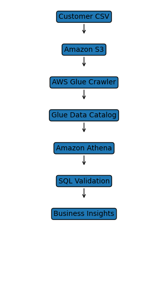

# 🚀 Enterprise Customer Data Quality Pipeline using AWS


---

# 📌 Project Overview

This project demonstrates an end-to-end cloud-based data quality pipeline built using Amazon Web Services (AWS).

The objective was to understand how structured customer data can be ingested, cataloged, queried, and validated using AWS analytics services while applying Data Stewardship concepts such as metadata management, duplicate detection, missing value analysis, and SQL-based data validation.

---

# 🎯 Business Scenario

Organizations receive customer master data from multiple business systems.

Before this data is consumed by reporting or analytics teams, it must be validated for:

- Duplicate records
- Missing mandatory fields
- Invalid values
- Metadata consistency
- Business rule compliance

This project simulates that workflow using AWS.

---

# ☁️ AWS Services Used

| Service | Purpose |
|----------|---------|
| Amazon S3 | Store customer dataset |
| AWS Glue | Discover schema |
| AWS Glue Crawler | Create metadata |
| AWS Glue Data Catalog | Store metadata |
| Amazon Athena | Query data using SQL |
| IAM | Manage service permissions |

---

# 🏗 Project Architecture



Workflow

```
Customer CSV
      │
      ▼
 Amazon S3
      │
      ▼
 AWS Glue Crawler
      │
      ▼
 Glue Data Catalog
      │
      ▼
 Amazon Athena
      │
      ▼
 SQL Data Quality Validation
```

---

# 📂 Dataset

Customer Master Dataset containing fields such as:

- Customer_ID
- First_Name
- Last_Name
- Email
- Phone
- Country
- State
- City
- Join_Date
- Status
- Customer_Type
- Revenue
- Credit_Score

The dataset intentionally contains several data quality issues to simulate real-world validation scenarios.

---

# 🔍 Data Quality Checks Performed

✔ Duplicate Customer IDs

✔ Duplicate Email Addresses

✔ Missing Email Validation

✔ Missing Customer Type

✔ Invalid Revenue Detection

✔ Customer Distribution Analysis

✔ Revenue by Customer Type

✔ Average Credit Score

---

# 💻 SQL Skills Demonstrated

- SELECT
- WHERE
- GROUP BY
- HAVING
- COUNT()
- SUM()
- AVG()
- COALESCE()

---

# 📊 Sample SQL Queries

## Total Records

```sql
SELECT COUNT(*) AS total_records
FROM customer_raw_data;
```

---

## Duplicate Customer IDs

```sql
SELECT customer_id,
COUNT(*) AS duplicate_count
FROM customer_raw_data
GROUP BY customer_id
HAVING COUNT(*)>1;
```

---

## Missing Emails

```sql
SELECT *
FROM customer_raw_data
WHERE email IS NULL;
```

---

## Revenue by Customer Type

```sql
SELECT
COALESCE(customer_type,'Missing') AS customer_type,
SUM(revenue) AS total_revenue
FROM customer_raw_data
GROUP BY COALESCE(customer_type,'Missing');
```

---

# 📸 Project Screenshots

## Amazon S3

Add screenshot here

---

## AWS Glue Database

Add screenshot here

---

## AWS Glue Crawler

Add screenshot here

---

## AWS Glue Table

Add screenshot here

---

## Amazon Athena Query

Add screenshot here

---

## Duplicate Detection

Add screenshot here

---

## Missing Email Validation

Add screenshot here

---

## Revenue Analysis

Add screenshot here

---

# 📈 Learning Outcomes

Through this project I gained practical exposure to:

- Amazon S3
- AWS Glue Crawlers
- AWS Glue Data Catalog
- Amazon Athena
- SQL on Cloud Data
- Metadata Management
- Data Validation
- Data Quality Analysis

---

# 🚀 Future Improvements

- Amazon QuickSight Dashboard
- Automated ETL using AWS Glue Jobs
- Data Quality Score Dashboard
- Scheduled Data Validation Pipeline
- CloudWatch Monitoring
- EventBridge Automation

---

# 📁 Repository Structure

```
aws-customer-data-quality-pipeline

│
├── README.md
├── LICENSE
├── customer_master.csv
├── architecture.png
└── screenshots/
```

---

# 👨‍💻 Author

**Sai Vivek**

Data Analyst | SQL | AWS | Data Quality | Data Stewardship

---

# ⭐ If you found this project useful, consider giving it a Star.
